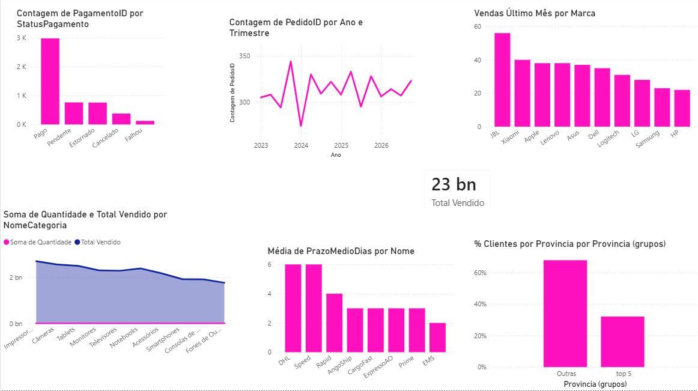
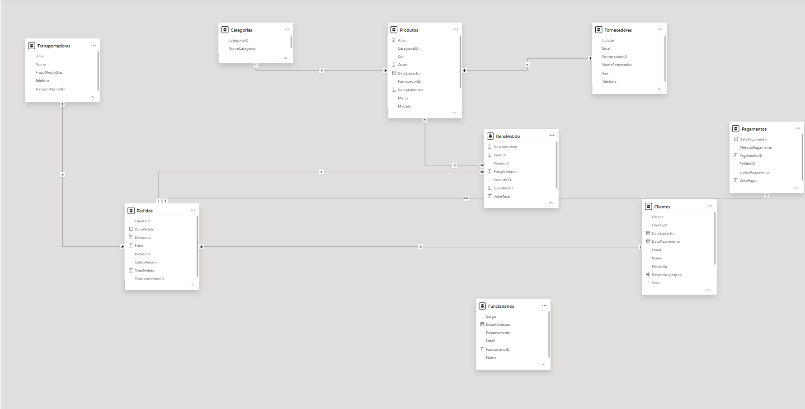
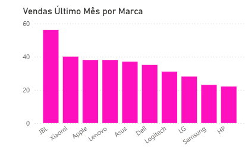
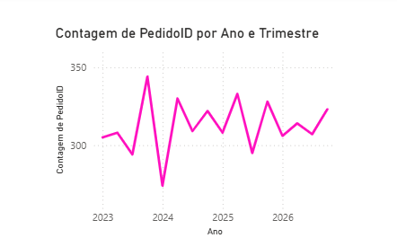

# Dashboard ShopX — Análise de Vendas de uma Loja de Eletrônicos

Dashboard desenvolvido em Power BI para analisar o desempenho de uma loja fictícia de eletrônicos no contexto de e-commerce.

O projeto foi desenvolvido como parte do meu percurso de estudo em Análise de Dados, com o objetivo de praticar não apenas ferramentas como Power BI, Power Query e DAX, mas principalmente o processo de transformar dados em informações que possam apoiar decisões de negócio.

---

## Dashboard



> Dashboard desenvolvido no Power BI, reunindo indicadores de vendas, clientes, produtos, pagamentos e logística.

---

##  Contexto

A ShopX é uma loja fictícia de eletrônicos criada especialmente para este projeto.

O dataset representa um e-commerce com dados de:

- Clientes
- Produtos
- Categorias
- Fornecedores
- Pedidos
- Itens de Pedido
- Pagamentos
- Transportadoras
- Funcionários

Os dados são sintéticos e foram gerados por IA, estruturados para representar um cenário semelhante ao de uma empresa real, utilizando nomes, cidades e províncias angolanas plausíveis.

O período analisado compreende **2023 a 2026**.

---

##  Por que este projeto?

O objetivo deste projeto não foi apenas construir um dashboard visualmente organizado.

A proposta foi simular uma situação em que um analista recebe dados de uma empresa e precisa:

1. compreender a estrutura dos dados;
2. identificar problemas de qualidade;
3. preparar e modelar os dados;
4. definir métricas relevantes;
5. investigar perguntas de negócio;
6. encontrar padrões nos dados;
7. transformar esses padrões em insights;
8. comunicar os resultados através de uma visualização clara.

Dessa forma, o projeto foi utilizado para praticar o ciclo completo de uma análise de dados dentro do Power BI.

---

#  Problema de negócio

A ShopX possui informações sobre vendas, clientes, produtos, pagamentos e logística, mas os dados estão distribuídos por diferentes tabelas.

A análise procura responder perguntas como:

- Quanto a empresa está vendendo?
- Quais categorias apresentam maior volume de vendas?
- Como os clientes estão distribuídos geograficamente?
- Quais marcas apresentam maior volume de vendas?
- Como os pedidos evoluem ao longo do tempo?
- Como estão distribuídos os pagamentos por status?
- Existem diferenças no prazo médio informado pelas transportadoras?

A partir dessas perguntas, foram construídas as análises apresentadas no dashboard.

---

#  Perguntas de negócio

1. Como estão distribuídos os pagamentos por status?
2. Quais categorias apresentam maior volume de vendas?
3. Como os clientes estão distribuídos pelas províncias?
4. Qual foi a marca mais vendida no último mês disponível no dataset?
5. Como o volume de pedidos evoluiu ao longo do tempo?
6. Qual é o prazo médio informado por cada transportadora?

---

#  Preparação e qualidade dos dados

Antes de iniciar a análise, os dados passaram por uma etapa de preparação no Power Query.

### Tratamentos realizados

- Padronização dos tipos de dados;
- Tratamento de textos;
- Remoção de espaços e inconsistências;
- Avaliação de colunas sem utilização direta;
- Verificação de valores inconsistentes;
- Análise da distribuição dos dados;
- Correção de problemas identificados durante a exploração.

### Problemas encontrados

Durante a análise inicial foram identificados alguns problemas nos dados originais, como:

- cores de produtos excessivamente uniformes;
- sobrenomes de clientes repetidos de forma pouco realista;
- inconsistências em status de pagamento;
- possíveis duplicidades/valores suspeitos em algumas categorias de dados.

Os dados foram posteriormente regenerados/ajustados para representar um cenário mais plausível.

---

#  Modelagem dos dados

A análise utiliza um modelo relacional composto por diferentes tabelas.

A principal cadeia utilizada na análise de vendas é:

`Pedidos → ItensPedido → Produtos`

Essa estrutura é complementada por:

- `Clientes`
- `Categorias`
- `Fornecedores`
- `Pagamentos`
- `Transportadoras`
- `Funcionários`

A separação das informações em diferentes tabelas permite analisar uma mesma venda sob diferentes perspectivas.

Por exemplo, para responder qual foi a marca mais vendida no último mês, foi necessário relacionar as tabelas `Pedidos → ItensPedido → Produtos`:

- a data do pedido está em `Pedidos`;
- o produto vendido está em `ItensPedido`;
- a marca e categoria estão em `Produtos`.

Essas informações, combinadas através dos relacionamentos entre as tabelas, foram necessárias para responder com precisão à pergunta sobre a marca mais vendida no último mês.

---

## 📸 Modelo de dados



---

#  Medidas DAX

| Medida | Objetivo |
|---|---|
| `Total Vendido` | Calcula o valor total das vendas |
| `Vendas Último Mês` | Calcula as vendas do mês anterior à data mais recente do dataset |
| `% Clientes por Provincia` | Calcula a participação percentual dos clientes por província |
| `Média de PrazoMedioDias` | Calcula o prazo médio informado por transportadora |

**Exemplo de aplicação:**

```dax
Vendas Último Mês =
CALCULATE(
    SUM(ItensPedido[Quantidade]),
    DATESINPERIOD(
        Pedidos[DataPedido],
        MAX(Pedidos[DataPedido]),
        -1,
        MONTH
    )
)
```

A medida `Vendas Último Mês` foi utilizada para responder à pergunta sobre a marca mais vendida no último mês disponível no dataset.

---

#  Análises e insights

## 1. Pagamentos por status

**O que os dados mostram?**

A maioria dos pagamentos apresenta o status **"Pago"**, enquanto os estados Pendente, Estornado, Cancelado e Falhou representam volumes menores.

**Como cheguei a essa conclusão?**

A distribuição foi obtida através da contagem dos registros de pagamento agrupados pelo campo `Status`, permitindo comparar a participação de cada estado no total de pagamentos.

---

## 2. Total vendido por categoria

**O que os dados mostram?**

**Impressoras** lidera em valor total vendido, à frente de Câmeras e Tablets, com uma queda gradual até a categoria de menor desempenho (Fones de Ouvido).

**Como cheguei a essa conclusão?**

O valor total vendido foi agrupado pela categoria dos produtos, permitindo comparar o desempenho de cada categoria.

> **Observação técnica:** este gráfico combina duas métricas em escalas muito diferentes (Total Vendido, na casa dos bilhões, e Soma de Quantidade, na casa das unidades) no mesmo eixo. Isso faz a linha de Quantidade aparecer achatada perto de zero, tornando o gráfico pouco confiável para comparar volume de unidades entre categorias — apenas para valor total vendido. Uma melhoria futura seria mover Soma de Quantidade para um eixo secundário.

---

## 3. Distribuição de clientes por província

**O que os dados mostram?**

A distribuição geográfica dos clientes é relativamente equilibrada. As cinco maiores províncias representam aproximadamente **32% da base total**, não havendo concentração extrema em uma única província.

**Como cheguei a essa conclusão?**

Foi calculado o percentual de clientes de cada província em relação ao total da base, usando a medida `% Clientes por Provincia`:

```dax
% Clientes por Provincia =
DIVIDE(
    COUNTROWS(Clientes),
    CALCULATE(COUNTROWS(Clientes), ALL(Clientes))
)
```

Isso permitiu analisar a representatividade de cada região em vez de observar apenas a quantidade absoluta de clientes.

---

## 4. Marca mais vendida no último mês



**O que os dados mostram?**

A **JBL** apresentou o maior volume de vendas no último mês disponível no dataset, seguida por Xiaomi, Apple e Lenovo.

**Como cheguei a essa conclusão?**

Primeiro foi definido o período correspondente ao último mês disponível nos dados. Em seguida, as vendas foram agrupadas por marca e comparadas entre si, usando a medida `Vendas Último Mês`, baseada em `DATESINPERIOD`, para restringir a análise ao período selecionado.

---

## 5. Pedidos ao longo do tempo



**O que os dados mostram?**

A análise trimestral entre 2023 e 2026 mostra oscilações no volume de pedidos ao longo do período, com o maior volume observado no **4º trimestre de 2023**.

**Como cheguei a essa conclusão?**

Os pedidos foram agrupados por ano e trimestre e comparados ao longo do período analisado, permitindo observar a evolução temporal e identificar períodos de maior ou menor volume de pedidos.

---

## 6. Prazo médio por transportadora

**O que os dados mostram?**

De acordo com os prazos cadastrados no dataset, a EMS apresenta média de aproximadamente **2 dias**, enquanto DHL e Speed apresentam aproximadamente **6 dias**.

**Como cheguei a essa conclusão?**

Os valores de `PrazoMedioDias` foram agrupados por transportadora e calculada a média para cada uma.

> **Importante:** esta métrica representa o prazo informado/cadastrado para cada transportadora. Não representa o tempo real de entrega de cada pedido, pois o dataset não possui uma data de entrega efetiva.

---

#  Principais conclusões

- A maior parte dos pagamentos possui status **Pago**;
- Impressoras lidera em valor total vendido entre as categorias;
- Os clientes estão distribuídos por diferentes províncias, sem concentração extrema em uma única região;
- A JBL apresentou o maior volume de vendas no último mês analisado;
- O volume de pedidos apresenta variações ao longo do tempo;
- Os prazos médios cadastrados diferem entre as transportadoras.

> Estas conclusões são específicas do dataset sintético utilizado e não representam o comportamento real do mercado angolano.

---

#  Ciclo de análise aplicado neste projeto

Este projeto seguiu o ciclo completo de uma análise de dados, aplicado à prática:

1. **Pergunta de negócio** — definição das 6 perguntas antes de iniciar a construção
2. **Importação** — dados do ShopX trazidos para o Power BI
3. **Exploração** — entendimento da estrutura das tabelas e de onde estava cada informação necessária
4. **Limpeza e qualidade** — tratamento no Power Query e identificação de problemas reais nos dados (cores uniformes, sobrenomes repetidos, status inconsistentes)
5. **Modelagem** — relacionamento entre tabelas (`Pedidos → ItensPedido → Produtos`, entre outras) para permitir responder perguntas que nenhuma tabela isolada resolveria
6. **Métricas** — criação de medidas DAX (`Total Vendido`, `Vendas Último Mês`, `% Clientes por Provincia`, `Média de PrazoMedioDias`)
7. **Visualização** — escolha do gráfico certo para cada pergunta
8. **Interpretação e comunicação** — transformar cada gráfico em insight, documentado na seção de Análises e Insights

---

#  O que este projeto permitiu praticar

- Importação de dados
- Power Query
- Limpeza e transformação de dados
- Modelagem relacional
- Relacionamentos entre tabelas
- DAX
- Criação de métricas
- Análise exploratória
- Análise temporal
- Análise geográfica
- Construção de visualizações
- Storytelling com dados
- Interpretação de resultados
- Identificação de limitações dos dados

---

#  Limitações

Este projeto utiliza dados sintéticos e possui algumas limitações.

### 1. Dados sintéticos

Os dados não representam uma empresa real e não devem ser utilizados para conclusões sobre o mercado angolano.

### 2. Prazo de entrega

Não existe uma data de entrega real associada a cada pedido. Por isso, não é possível calcular o tempo efetivo de entrega nem comparar diretamente o prazo prometido com o prazo realizado.

---

#  Possíveis melhorias

- Adicionar data de entrega real por pedido;
- Calcular atraso médio por transportadora;
- Comparar prazo prometido vs. prazo realizado;
- Mover Soma de Quantidade para um eixo secundário no gráfico de categorias;
- Criar análise de clientes recorrentes;
- Identificar clientes VIP/inativos;
- Analisar ticket médio;
- Criar análise de crescimento mensal/anual;
- Investigar sazonalidade;
- Criar análises específicas para períodos como Black Friday e Natal;
- Analisar produtos mais e menos vendidos;
- Criar indicadores de desempenho mais completos.

---

#  Ferramentas utilizadas

Power BI Desktop (Power Query, modelagem de dados, DAX)

---

*Projeto desenvolvido como parte de um percurso de autoestudo em análise de dados.*
